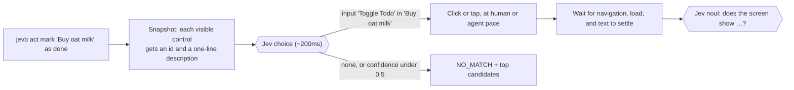

# jevb

**Browser and phone use for AI agents, in plain English. The agent says what it wants; a small model finds it.**

```bash
jevb open https://demo.playwright.dev/todomvc/
jevb type the new todo box --enter -- Buy oat milk
jevb type the new todo box --enter -- Call the plumber
jevb act mark "Buy oat milk" as done             # picks: input "Toggle Todo" in "Buy oat milk"
jevb check does the counter say "1 item left"?    # pass → exit 0
```

No selectors, and no page snapshots in your agent's context. jevb drives a
real browser (or a real iPhone or Android phone). A small, fast decision
model, [Jev](https://docs.typesafe.ai), answers the questions that need
understanding: *which element did you mean?*, *does the screen show this?*,
*which text answers this?* Each answer takes about 150–300ms, and your
agent reads back a short JSON object.

MIT · Node 22+ · headless Chromium, your own Chrome, iOS and Android

---

## Why

To use a browser, an agent has to decide what to click. Today it does that
one of two ways:

- **Selectors** (Playwright and similar scripts). Fast, but someone has to
  know the page in advance and write them. That doesn't work for "go change
  this setting" on a page the agent has never seen, and the selectors break
  on the next redesign.
- **Reading the page** (Playwright MCP, Claude in Chrome, IDE browser
  panes). The tool hands the model an accessibility snapshot of the whole
  page, and the model picks an element from it. No selectors, but every step
  makes your most expensive model read thousands of tokens, and the
  snapshots pile up in its context.

jevb takes a third way. The agent states its intent in a sentence, a small
decision model picks the element, and the agent gets back about 20 tokens.
Here is one step on three real pages, measured October 2026:

| Page | Snapshot the agent reads to pick | What jevb returns | jevb's pick |
|---|---|---|---|
| [treechat.com](https://treechat.com/stream/public) | ~5,800 tokens | ~15 tokens | the "Hot" tab, 0.93 |
| [news.ycombinator.com](https://news.ycombinator.com) | ~9,900 tokens | ~20 tokens | the first story's comments, 0.84 |
| [github.com/microsoft/playwright](https://github.com/microsoft/playwright) | ~11,800 tokens | ~23 tokens | the "Issues" tab, 0.90 |

Over a 20-step task, that's 120–240k tokens of snapshots against a few
thousand with jevb, so long browser tasks fit in context and each step
costs a ~200ms small-model call instead of a frontier-model read. End to
end, a 23-step tour of treechat.com took 18–26s and about $0.003 in Jev
calls, against 55–58s and $0.75–0.95 with the agent driving the browser
itself.

The tradeoff is visibility. A snapshot tool shows the agent everything; jevb
shows it what it asks for:

- `jevb read` returns the screen's text (150–750 tokens on those pages), and
  `jevb read <question>` returns just the text that answers it.
- `jevb check <question>` asks a yes/no about the screen.
- When jevb isn't sure, it says so: a low-confidence pick returns `NO_MATCH`
  with the top candidates instead of guessing a click. A *confident* wrong
  pick is visible only in the one-line description jevb reports back.
- Complex widgets (canvas, drag and drop, maps) may still need `jevb eval`
  or a snapshot tool.

For fixed regression tests on pages you control, plain Playwright is still
faster, free and deterministic. jevb is for everything else: an agent using
a site it doesn't know, checking its own UI work, smoke tests that should
outlive redesigns, and real phones.

## Quick start

```bash
npm install -g https://github.com/mitya777/jevb/releases/latest/download/jevb.tgz
export TYPESAFEAI_API_KEY=...     # key: https://console.typesafe.ai/keys
jevb setup                        # installs headless Chromium if needed, checks the key
```

`jevb setup` prints JSON and exits 0 only when jevb can launch a browser and
reach Jev. Each failing check comes with a `fix` field. Then try it:

```bash
jevb open https://demo.playwright.dev/todomvc/
jevb type the new todo box --enter -- Buy oat milk
jevb type the new todo box --enter -- Call the plumber
jevb act mark "Buy oat milk" as done
jevb check does the counter say "1 item left"?
jevb stop
```

Every command prints one JSON object. The exit code is 1 on an error or a
failed check. Add `JEVB_HEADED=1` to watch, or `--pace agent` to go as fast
as the page allows.

## Hand it to your coding agent

**Installing.** Point your agent at this README, or paste:

> Install jevb: `npm install -g https://github.com/mitya777/jevb/releases/latest/download/jevb.tgz`,
> then run `jevb setup` and fix whatever its JSON reports. The only thing you
> may need from me is a TypeSafe API key (TYPESAFEAI_API_KEY).

**Using.** Add this to your `AGENTS.md` or `CLAUDE.md`:

```markdown
## Checking UI changes with jevb
After changing UI, verify it in a real browser with jevb (one JSON object per
command; exit 1 = error or failed check):
- `jevb open <url>` · `jevb act <what to click>` · `jevb type <which field> -- <text>`
- `jevb check <question about what's on screen>` · `jevb refute <question>`
- `jevb read` prints the on-screen text; `jevb read <question>` returns the text that answers it.
- `jevb snap` lists what jevb can click. Read it after a NO_MATCH, then rephrase.
- Name visible text in checks: `check is a "Saved" toast shown?`, not `check did it work?`.
- Use `--pace agent` for speed. Run `jevb stop` when done.
```

`jevb update` installs the newest release later, and `jevb update --check`
only reports.

## How it works



Each design choice below came from a measurement:

- **The pick never sees page text.** Jev chooses from short control
  descriptions plus the URL and title. Adding the page text dropped pick
  confidence from 0.94 to about 0.5 on a real sign-up page.
- **Checks see only what's on screen.** Checks get the viewport's text, or
  only the dialog's text while a dialog is open, plus form values with
  passwords masked. With whole-page text, "is a thread shown?" passed at 0.92
  *behind* a sign-up popup.
- **Repeated controls carry their item.** Several "Reply" or "Edit" buttons
  each read as `button "Edit" in "Grace Hopper grace@…"`. This works for
  tables, cards, nested comments and title/action rows like Hacker News, on
  web pages and in native app screens.
- **First/last is code's job.** "Edit the last row" sends the copies to Jev
  as one option (`button "Edit" ×3, one per item`). Jev judges the kind of
  control, and jevb picks the bottommost on screen.
- **Real controls, not just tags.** Clickable `<div>`s with a pointer cursor
  (the usual React pattern) count. So do custom checkboxes hidden at opacity
  0 under a styled label. Anything covered by a popup doesn't.
- **Reading is a pick, too.** `jevb read <question>` splits the screen's
  text into blocks, each with its kind and the text around it
  (`text "$40" in "Red kettle … Add to cart"`), and Jev picks the block
  that answers. The answer is page text, word for word, so it can't be made
  up, and it costs one ~200ms call. If nothing on screen answers, you get
  `NO_MATCH`. `jevb read` with no question returns the screen's text
  without calling Jev.
- **It waits like Playwright.** A failing check, or an action whose target
  isn't on screen yet, is re-judged every 0.6s for up to `JEVB_WAIT_MS`
  (default 4s; 0 turns it off), so a list behind a spinner or the screen
  right after logging in doesn't fail the step.
- **Checks ride along.** Consecutive checks share one Jev request, sent in
  parallel with the next step's pick. Checks always judge the screen
  *before* the action.
- **On demand.** The first command starts a local daemon. Chromium launches on
  first use and closes after 2 minutes idle. A session that expired fails
  with `SESSION_EXPIRED`, so a check can't pass against a blank page.
- **Two paces.** `human` (the default) moves the mouse along curves, dwells
  on hover, types key by key and pauses to read. This catches hover, focus
  and debounce bugs, and makes recordings watchable. `agent` uses direct
  clicks and `fill()`, and waits only on the page.

## Scenarios

A `.jevb` file has one step per line. The runner stops at the first step
that throws, and exits non-zero if any check fails.

```
pace agent
open /login
act go to create a new account
check is a sign-up form with "Username" and "Email" fields shown?
type the email field => ${TEST_EMAIL}
check@0.9 is the "Join" button enabled?
refute is an error or "not found" page shown?
act? dismiss the cookie banner
shot out/signup.png
```

```bash
jevb run examples/todomvc.jevb
jevb run smoke.jevb --base http://localhost:5173 --pace agent
```

| Step | Does |
|---|---|
| `open <url>` | navigate (relative to `--base`) |
| `act <intent>` | Jev picks a control, jevb clicks it |
| `act? <intent>` | same, but no match is skipped, not failed |
| `type <field> => <text>` | pick a field and type; `${NAME}` comes from env or `./.env` and is never echoed |
| `press <key>` | `Enter`, `Escape`, `Meta+K`; on phones `Back`, `HideKeyboard` |
| `scroll [px\|end\|top]` | follows in-app scroll panels |
| `read <question>` | the on-screen text that answers, verbatim, in the results |
| `check <question>` | pass if Jev's noul ≥ 0.7 (`check@0.9` sets the bar) |
| `refute <question>` | pass if noul < 0.3 |
| `wait <ms>` · `shot <file>` · `pace human\|agent` | |
| `device <name>` · `app <file\|id>` | the next `open` starts a phone |

Write checks about text that's visible. Jev reads text, not pixels: "is a
feed shown?" scores about 0.6, while "is a Public stream with Now, Hot and
Top tabs shown?" scores about 0.8.

## CLI

| Command | |
|---|---|
| `open <url>` | navigate; starts the daemon and browser on demand |
| `act <intent>` | pick and click; `--check Q` / `--refute Q` ride along |
| `type <intent> -- <text>` | pick a field and type; `--enter` submits |
| `check` / `refute <question>` | assert; `--threshold` |
| `checks --check Q --refute Q …` | many checks in one Jev request |
| `press <key>` · `scroll [dy\|end\|top]` | |
| `read [question] [--full]` | no question: on-screen text and form fields (no Jev call); a question: the text that answers it, verbatim; `--full`: the whole page |
| `snap` | the controls Jev chooses from |
| `shot <path> [--full]` | screenshot |
| `eval -- <js>` | run a function body in the page and print its result |
| `run <file.jevb>` | run a scenario in-process (`--base`, `--pace`, `--no-batch`) |
| `close` · `stop` · `status` | end a session · stop everything · show state |
| `setup` · `update [--check]` · `version` | |

All commands take `--session NAME` for parallel isolated sessions and
`--pace human|agent`. From code: `import { JevBrowser, JevDevice, runScenario } from 'jevb'`.

## Signed-in flows

Attach to a real Google Chrome that has its own persistent profile, instead
of a throwaway Chromium:

```bash
bin/jevb-chrome.sh           # starts Chrome with ~/.jevb/chrome-profile and prints JEVB_CDP_URL
export JEVB_CDP_URL=http://127.0.0.1:9333
```

Sign in once in that window. jevb sessions then open as tabs in that profile,
with its cookies and saved passwords. Idle and `stop` detach but leave jevb's
tabs open, so a page you're signed in to stays put; `close` closes its tab.
Set `JEVB_CLOSE_TABS=1` to close jevb's tabs on idle and `stop` too.

## Phones and simulators

The same commands drive an iPhone or Android phone: a real one on AWS Device
Farm, or a simulator, emulator or USB phone through your own Appium. jevb
reads the device's accessibility tree, and taps, swipes and typing are touch
gestures.

```bash
jevb open https://example.com --device "iphone 15"        # Safari on the phone
jevb open --device "pixel 9" --app build/app.apk            # install and launch an app
jevb act open the settings
jevb close                                                  # ends the session
```

### Real phones on AWS Device Farm

Pay per device minute, us-west-2 only. `jevb devices --platform ios` lists
what you can open. A phone takes about a minute to start, and jevb stops it
on `close`, on `stop`, on errors, and after 3 idle minutes, so you aren't
billed for a forgotten session.

jevb needs AWS credentials allowed to use Device Farm
(`AWSDeviceFarmFullAccess` is enough). It takes the first of:

1. **`JEVB_AWS_PROFILE=<name>`**, a profile from `~/.aws`.
2. **A profile named `jevb`** in `~/.aws/credentials`, used automatically. A
   Device-Farm-only key there stays out of everything else (commands under
   *Device Farm setup* below).
3. **The standard AWS chain:** `AWS_PROFILE`, or `AWS_ACCESS_KEY_ID` and
   `AWS_SECRET_ACCESS_KEY` (plus `AWS_SESSION_TOKEN` for temporary
   credentials) in the environment or in `./.env`, or `aws login`.

A profile always wins over keys: with a `jevb` profile or `AWS_PROFILE` set,
keys in the environment or `.env` are ignored.

### Simulators, emulators and USB phones with Appium

Free and local. Install [Appium](https://appium.io) with the driver for each
platform, start it, and point jevb at it:

```bash
npm install -g appium
appium driver install xcuitest       # iOS simulators and USB iPhones (needs Xcode)
appium driver install uiautomator2   # Android emulators and USB phones (needs the Android SDK)
appium                               # listens on http://127.0.0.1:4723

export JEVB_APPIUM_URL=http://127.0.0.1:4723
jevb open https://example.com --device "iPhone 16"                      # Safari in a booted simulator
jevb open --device "iPhone 16" --app build/MyApp.app                    # a simulator build
jevb open --device "emulator" --platform android --app app-debug.apk    # a running emulator
```

- `--device` is the simulator or device name. Set `JEVB_APPIUM_UDID` to pick
  one exactly (`xcrun simctl list devices booted`, `adb devices`).
- `--app` takes a local `.app` (simulator build), `.ipa` or `.apk`, or the
  bundle id / package name of an installed app. A name that doesn't say
  iPhone or iPad needs `--platform`.
- The first iOS session builds WebDriverAgent, which can take several
  minutes. Later sessions reuse it.
- USB iPhones need WebDriverAgent signed with your Apple team; see the
  Appium XCUITest driver docs.
- Simulators are slower than Device Farm phones: 7–17s per tap on an iPhone
  16 simulator, against 0.5–1.5s on Device Farm.

### Controls with no name: the Claude fallback

Native apps often have icon buttons with no accessible name (they reach Jev
as a bare "Button"), or clickable views missing from the tree entirely
(Android doesn't expose a clickable `<div>` with no role). With
`ANTHROPIC_API_KEY` set (in the environment or `./.env`), jevb has one
fallback when Jev finds no confident match on an app screen:

- **Claude Sonnet locates the control.** jevb sends the screenshot (shrunk to
  at most 720px wide) and the intent, and Claude's computer use says where to
  tap. If that point falls inside a real control in the tree, jevb taps that
  control's center; otherwise it taps the point (the pick reports `visual`).
  It costs about 6k tokens (1–2 cents) and 1.5–4s, and it hit 4 of 5 test
  targets. Asking a model for "x,y" in plain text was off by 100px or more.
- **Naming controls first was tried and dropped.** Having Claude Haiku label
  the unnamed controls got 3–4 of 8 right, and one confident wrong label led
  to a wrong tap.

App screens are also read from their screenshots when the tree lags. After
an in-app navigation, an Android tree can still hold the previous screen
while the new one is plainly visible. With `ANTHROPIC_API_KEY` set, checks on
app screens judge the text Claude Haiku reads from the screenshot (1–6s,
cached per image). The tree's form fields are kept, so passwords stay
masked. If the tree's text barely matches the screen (under 30% word
overlap), its elements count as stale and taps go to the Sonnet fallback.
`JEVB_SCREEN_TEXT=off` keeps the tree's text.

`JEVB_LOCATE_MODEL` swaps the locating model (default `claude-sonnet-5`). An
accessible name in your app is still the real fix, and makes jevb faster
too.

<details>
<summary>Device Farm setup and more phone details</summary>

A Device-Farm-only IAM key in a profile named `jevb`:

```bash
aws iam create-user --user-name jevb
aws iam attach-user-policy --user-name jevb --policy-arn arn:aws:iam::aws:policy/AWSDeviceFarmFullAccess
aws iam create-access-key --user-name jevb --query 'AccessKey.[AccessKeyId,SecretAccessKey]' --output text | read id secret && aws configure set aws_access_key_id "$id" --profile jevb && aws configure set aws_secret_access_key "$secret" --profile jevb && aws configure set region us-west-2 --profile jevb
```

- `--app` takes a local `.apk`/`.ipa` (uploaded), an https/s3 URL, an upload
  ARN, or an installed bundle id. iOS needs a device build (`.ipa`), not a
  simulator build.
- iOS system alerts (permission prompts) aren't in the app's tree on Device
  Farm, so jevb reads them through the alert API. While an alert is up, it's
  the only thing on screen.
- `press HideKeyboard` closes the keyboard. On Android, `press Back` closes the
  keyboard first, like the real button. On iOS, Back is an edge swipe.
- Unlabeled web inputs (a WebView sign-up form) take the text just above them
  as their label. On Android, jevb sets field values directly, so the
  keyboard can't autocapitalize them.
- Device Farm records every session. The MP4 is under the session's artifacts
  once it finishes stopping.
- jevb uses a Device Farm project named `jevb`, created on first use, or
  the one in `JEVB_DF_PROJECT_ARN`.

</details>

## Configuration

Put these in the environment, or in `.env` in the directory you run jevb
from (see [.env.example](.env.example)). Shell variables win.

| Variable | |
|---|---|
| `TYPESAFEAI_API_KEY` (or `TYPESAFE_API_KEY`) | **required**, from [console.typesafe.ai/keys](https://console.typesafe.ai/keys) |
| `JEVB_PACE` | `human` (default) or `agent` |
| `JEVB_WAIT_MS` | how long checks and actions wait for the screen (4000; 0 = off) |
| `JEVB_HEADED=1` · `JEVB_DEMO=1` · `JEVB_VIDEO=<dir>` | show the window · draw a cursor and a HUD of Jev's picks · record a `.webm` per session |
| `JEVB_IDLE_MS` · `JEVB_DAEMON_IDLE_MS` · `JEVB_PORT` | browser idle close (2 min) · daemon exit (15 min) · daemon port (7788) |
| `JEVB_CDP_URL` · `JEVB_CLOSE_TABS=1` | attach to a running Chrome · close jevb's tabs on idle and `stop` |
| `JEVB_CDP_PORT` · `JEVB_CHROME_PROFILE` · `JEVB_CHROME_PROFILE_DIR` | for `bin/jevb-chrome.sh`: DevTools port (9333) · profile folder (`~/.jevb/chrome-profile`) · which Chrome profile inside it to open |
| `AWS_ACCESS_KEY_ID` · `AWS_SECRET_ACCESS_KEY` · `AWS_SESSION_TOKEN` · `JEVB_AWS_PROFILE` | Device Farm credentials (see *Phones and simulators*) |
| `JEVB_DF_PROJECT_ARN` · `JEVB_DEVICE_IDLE_MS` | Device Farm project · release an idle phone (3 min) |
| `JEVB_APPIUM_URL` · `JEVB_APPIUM_UDID` | local Appium |
| `ANTHROPIC_API_KEY` · `JEVB_LOCATE_MODEL` · `JEVB_TEXT_MODEL` · `JEVB_SCREEN_TEXT=off` | the Claude fallback for native apps (Sonnet locates unnamed controls; Haiku reads lagging screens) |
| `JEV_MODEL` · `TYPESAFE_ENDPOINT` | Jev model (default `jev-latest`) · another Jev-compatible endpoint |
| `GH_TOKEN` / `GITHUB_TOKEN` | lets `jevb update` read releases while the repo is private (otherwise your `gh` login is used) |

## Cost and speed

Measured in September 2026:

| | |
|---|---|
| Jev call | 140–310ms |
| Chromium cold start | 220–400ms |
| [`examples/todomvc.jevb`](examples/todomvc.jevb), 6 checks and 8 actions | ~8s at agent pace, ~14s at human pace, 11 Jev calls |
| A 23-step tour of [treechat.com](https://treechat.com) | 17–18s agent, ~48s human |
| The same tour, an LLM agent driving the browser itself | 55–58s and ~$0.75–0.95 per run, vs ~$0.003 in Jev calls |
| Real phone on Device Farm | ~60–70s to the first command, then 0.5–1.5s per step |

## Status

Experimental and in active use. Things to know:

- **Jev is a hosted service.** jevb needs a TypeSafe account and sends each
  pick's control list and each check's screen text to it. Don't point jevb
  at screens with data you can't send to a third party.
- **Jev reads text, not pixels.** Canvas apps, charts and image-only buttons
  need accessible names, or the Claude fallback on phones.
- **Known weak spot:** with no matching control, Jev can map a nearby verb to
  an existing one (it treated "flag" as "hide"). The live suite tracks this.

## Developing

```bash
git clone https://github.com/mitya777/jevb && cd jevb && npm install
npx playwright-core install chromium-headless-shell
npm test            # offline, ~30s: real Chromium + a fake Jev; no key, no cost
npm run test:live   # the same fixtures judged by the real Jev, with confidence margins
```

`test/harness` serves fixture pages (modals, pointer-div rows, icon buttons,
covered and offscreen controls, six layouts of repeated controls) and runs a
deterministic fake Jev that records every request. Tests can therefore
assert exactly what jevb sends. `test:live` prints each case's confidence
next to its threshold, so model drift shows up before a case flips.

`examples/treechat/` has the scenarios jevb was first built against (web and
native app), kept as larger real-world examples.

**Releasing:** run `npm version patch|minor|major && git push --follow-tags`.
The tag runs the tests and publishes a GitHub Release with the packed
tarball, which `jevb update` installs.

## License

MIT. See [LICENSE](LICENSE).
