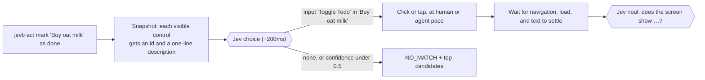

# jevb

**Browser and phone tests in plain English, built for coding agents and CI.**

```bash
jevb open https://demo.playwright.dev/todomvc/
jevb type the new todo box --enter -- Buy oat milk
jevb type the new todo box --enter -- Call the plumber
jevb act mark "Buy oat milk" as done             # picks: input "Toggle Todo" in "Buy oat milk"
jevb check does the counter say "1 item left"?    # pass → exit 0
```

No selectors and no screenshots sent to a large model. jevb drives a real
browser (or a real iPhone or Android phone). A small, fast model,
[Jev](https://docs.typesafe.ai), answers only the two questions that need
understanding: *which element did you mean?* and *does the screen show this?*
Each answer takes about 150–300ms. Code does everything else.

MIT · Node 22+ · headless Chromium, your own Chrome, iOS and Android

---

## Why

Coding agents now make most UI changes, and an agent needs to *see* that its
change works. The usual options both fall short:

- **An LLM driving a browser from screenshots** works, but every step is a
  large-model round trip. On one 23-step tour of a real site, an agent
  driving the browser itself took 55–58s and cost about $0.75–0.95 per run.
  jevb ran the same tour in 18–26s for about $0.003 in Jev calls.
- **Playwright with selectors** is fast, but the agent has to write and
  maintain selectors for markup it didn't design. "Is the right thing on
  screen?" becomes custom assertion code, and the selectors break on the
  next redesign.

jevb sits in between. Steps read the way a person would describe them
(`act open the settings`, `check is a sign-up form shown?`), so they survive
redesigns and anyone can review them. Each step costs one small-model call,
not a frontier-model turn. When jevb isn't sure, it says so: a low-confidence
pick returns `NO_MATCH` with the top candidates instead of guessing a click.

Plain Playwright is still faster per step. Reach for jevb where
selectors are the bottleneck: an agent checking its own work, smoke tests
that outlive redesigns, and real phones.

## Quick start

```bash
npm install -g https://github.com/mitya777/jevb/releases/latest/download/jevb.tgz
export TYPESAFEAI_API_KEY=...     # key: https://console.typesafe.ai/keys
jevb setup                        # installs headless Chromium if needed, checks the key
```

`jevb setup` prints JSON and exits 0 only when jevb can launch a browser and
reach Jev. Each failing check comes with a `fix` field. Then try it:

```bash
jevb open https://demo.playwright.dev/todomvc/
jevb type the new todo box --enter -- Buy oat milk
jevb type the new todo box --enter -- Call the plumber
jevb act mark "Buy oat milk" as done
jevb check does the counter say "1 item left"?
jevb stop
```

Every command prints one JSON object. The exit code is 1 on an error or a
failed check. Add `JEVB_HEADED=1` to watch, or `--pace agent` to go as fast
as the page allows.

## Hand it to your coding agent

**Installing.** Point your agent at this README, or paste:

> Install jevb: `npm install -g https://github.com/mitya777/jevb/releases/latest/download/jevb.tgz`,
> then run `jevb setup` and fix whatever its JSON reports. The only thing you
> may need from me is a TypeSafe API key (TYPESAFEAI_API_KEY).

**Using.** Add this to your `AGENTS.md` or `CLAUDE.md`:

```markdown
## Checking UI changes with jevb
After changing UI, verify it in a real browser with jevb (one JSON object per
command; exit 1 = error or failed check):
- `jevb open <url>` · `jevb act <what to click>` · `jevb type <which field> -- <text>`
- `jevb check <question about what's on screen>` · `jevb refute <question>`
- `jevb snap` lists what jevb can click. Read it after a NO_MATCH, then rephrase.
- Name visible text in checks: `check is a "Saved" toast shown?`, not `check did it work?`.
- Use `--pace agent` for speed. Run `jevb stop` when done.
```

`jevb update` installs the newest release later, and `jevb update --check`
only reports.

## How it works



Each design choice below came from a measurement:

- **The pick never sees page text.** Jev chooses from short control
  descriptions plus the URL and title. Adding the page text dropped pick
  confidence from 0.94 to about 0.5 on a real sign-up page.
- **Checks see only what's on screen.** Checks get the viewport's text, or
  only the dialog's text while a dialog is open, plus form values with
  passwords masked. With whole-page text, "is a thread shown?" passed at 0.92
  *behind* a sign-up popup.
- **Repeated controls carry their item.** Several "Reply" or "Edit" buttons
  each read as `button "Edit" in "Grace Hopper grace@…"`. This works for
  tables, cards, nested comments and title/action rows like Hacker News, on
  web pages and in native app screens.
- **First/last is code's job.** "Edit the last row" sends the copies to Jev
  as one option (`button "Edit" ×3, one per item`). Jev judges the kind of
  control, and jevb picks the bottommost on screen.
- **Real controls, not just tags.** Clickable `<div>`s with a pointer cursor
  (the usual React pattern) count. So do custom checkboxes hidden at opacity
  0 under a styled label. Anything covered by a popup doesn't.
- **Checks ride along.** Consecutive checks share one Jev request, sent in
  parallel with the next step's pick. Checks always judge the screen
  *before* the action.
- **On demand.** The first command starts a local daemon. Chromium launches on
  first use and closes after 2 minutes idle. A session that expired fails
  with `SESSION_EXPIRED`, so a check can't pass against a blank page.
- **Two paces.** `human` (the default) moves the mouse along curves, dwells
  on hover, types key by key and pauses to read. This catches hover, focus
  and debounce bugs, and makes recordings watchable. `agent` uses direct
  clicks and `fill()`, and waits only on the page.

## Scenarios

A `.jevb` file has one step per line. The runner stops at the first step
that throws, and exits non-zero if any check fails.

```
pace agent
open /login
act go to create a new account
check is a sign-up form with "Username" and "Email" fields shown?
type the email field => ${TEST_EMAIL}
check@0.9 is the "Join" button enabled?
refute is an error or "not found" page shown?
act? dismiss the cookie banner
shot out/signup.png
```

```bash
jevb run examples/todomvc.jevb
jevb run smoke.jevb --base http://localhost:5173 --pace agent
```

| Step | Does |
|---|---|
| `open <url>` | navigate (relative to `--base`) |
| `act <intent>` | Jev picks a control, jevb clicks it |
| `act? <intent>` | same, but no match is skipped, not failed |
| `type <field> => <text>` | pick a field and type; `${NAME}` comes from env or `./.env` and is never echoed |
| `press <key>` | `Enter`, `Escape`, `Meta+K`; on phones `Back`, `HideKeyboard` |
| `scroll [px\|end\|top]` | follows in-app scroll panels |
| `check <question>` | pass if Jev's noul ≥ 0.7 (`check@0.9` sets the bar) |
| `refute <question>` | pass if noul < 0.3 |
| `wait <ms>` · `shot <file>` · `pace human\|agent` | |
| `device <name>` · `app <file\|id>` | the next `open` starts a phone |

Write checks about text that's visible. Jev reads text, not pixels: "is a
feed shown?" scores about 0.6, while "is a Public stream with Now, Hot and
Top tabs shown?" scores about 0.8.

## CLI

| Command | |
|---|---|
| `open <url>` | navigate; starts the daemon and browser on demand |
| `act <intent>` | pick and click; `--check Q` / `--refute Q` ride along |
| `type <intent> -- <text>` | pick a field and type; `--enter` submits |
| `check` / `refute <question>` | assert; `--threshold` |
| `checks --check Q --refute Q …` | many checks in one Jev request |
| `press <key>` · `scroll [dy\|end\|top]` | |
| `snap` | the controls Jev chooses from |
| `shot <path> [--full]` | screenshot |
| `eval -- <js>` | run a function body in the page and print its result |
| `run <file.jevb>` | run a scenario in-process (`--base`, `--pace`, `--no-batch`) |
| `close` · `stop` · `status` | end a session · stop everything · show state |
| `setup` · `update [--check]` · `version` | |

All commands take `--session NAME` for parallel isolated sessions and
`--pace human|agent`. From code: `import { JevBrowser, JevDevice, runScenario } from 'jevb'`.

## Signed-in flows

Attach to a real Google Chrome that has its own persistent profile, instead
of a throwaway Chromium:

```bash
bin/jevb-chrome.sh           # starts Chrome with ~/.jevb/chrome-profile and prints JEVB_CDP_URL
export JEVB_CDP_URL=http://127.0.0.1:9333
```

Sign in once in that window. jevb sessions then open as tabs in that profile,
with its cookies and saved passwords. `stop` closes only jevb's tabs.

## Real phones

The same commands drive a real iPhone or Android phone. jevb reads the
device's accessibility tree, and taps, swipes and typing are touch gestures.

```bash
jevb devices --platform ios
jevb open https://example.com --device "iphone 15"        # Safari on a real iPhone
jevb open --device "pixel 9" --app build/app.apk            # install and launch an app
jevb act open the settings
jevb close                                                  # stops the billed session
```

- **AWS Device Farm** (pay per device minute, us-west-2): any AWS
  credentials with `AWSDeviceFarmFullAccess`. jevb picks up an AWS profile
  named `jevb` automatically. A phone takes about a minute to start. jevb
  stops it on `close`, on `stop`, on errors, and after 3 idle minutes.
- **Local Appium** (free): set `JEVB_APPIUM_URL=http://127.0.0.1:4723` for a
  simulator, an emulator or a USB phone.
- **Unlabeled controls** (icon buttons with no accessible name): with
  `ANTHROPIC_API_KEY` set, Claude Haiku names them from one screenshot. As a
  last resort, Claude's computer use locates the control on screen. An
  accessible name in your app is still the real fix.

<details>
<summary>Device Farm setup and phone details</summary>

A Device-Farm-only IAM key in a profile named `jevb`:

```bash
aws iam create-user --user-name jevb
aws iam attach-user-policy --user-name jevb --policy-arn arn:aws:iam::aws:policy/AWSDeviceFarmFullAccess
aws iam create-access-key --user-name jevb --query 'AccessKey.[AccessKeyId,SecretAccessKey]' --output text | read id secret && aws configure set aws_access_key_id "$id" --profile jevb && aws configure set aws_secret_access_key "$secret" --profile jevb && aws configure set region us-west-2 --profile jevb
```

- `--app` takes a local `.apk`/`.ipa` (uploaded), an https/s3 URL, an upload
  ARN, or an installed bundle id. iOS needs a device build (`.ipa`), not a
  simulator build.
- iOS system alerts (permission prompts) aren't in the app's tree on Device
  Farm, so jevb reads them through the alert API. While an alert is up, it's
  the only thing on screen.
- `press HideKeyboard` closes the keyboard. On Android, `press Back` closes the
  keyboard first, like the real button. On iOS, Back is an edge swipe.
- Unlabeled web inputs (a WebView sign-up form) take the text just above them
  as their label. On Android, jevb sets field values directly, so the
  keyboard can't autocapitalize them.
- Device Farm records every session. The MP4 is under the session's artifacts
  once it finishes stopping.
- Pick a different profile with `JEVB_AWS_PROFILE`, or a project with
  `JEVB_DF_PROJECT_ARN`. By default jevb uses a project named `jevb`, created
  on first use.

</details>

## Configuration

Put these in the environment, or in `.env` in the directory you run jevb
from (see [.env.example](.env.example)). Shell variables win.

| Variable | |
|---|---|
| `TYPESAFEAI_API_KEY` | **required**, from [console.typesafe.ai/keys](https://console.typesafe.ai/keys) |
| `JEVB_PACE` | `human` (default) or `agent` |
| `JEVB_HEADED=1` · `JEVB_DEMO=1` · `JEVB_VIDEO=<dir>` | show the window · draw a cursor and a HUD of Jev's picks · record a `.webm` per session |
| `JEVB_IDLE_MS` · `JEVB_DAEMON_IDLE_MS` · `JEVB_PORT` | browser idle close (2 min) · daemon exit (15 min) · daemon port (7788) |
| `JEVB_CDP_URL` | attach to a running Chrome |
| `AWS_*` · `JEVB_AWS_PROFILE` · `JEVB_DF_PROJECT_ARN` · `JEVB_DEVICE_IDLE_MS` | Device Farm |
| `JEVB_APPIUM_URL` · `JEVB_APPIUM_UDID` | local Appium |
| `ANTHROPIC_API_KEY` · `JEVB_LABEL_MODEL` · `JEVB_LOCATE_MODEL` | naming unlabeled native controls |
| `JEV_MODEL` | Jev model (default `jev-latest`) |

## Cost and speed

Measured in September 2026 against a production web app:

| | |
|---|---|
| Jev call | 140–310ms |
| Chromium cold start | 220–400ms |
| [`examples/todomvc.jevb`](examples/todomvc.jevb), 6 checks and 8 actions | ~8s at agent pace, ~14s at human pace, 11 Jev calls |
| A 23-step tour of a production site | 17–18s agent, ~48s human |
| The same tour, an LLM agent driving the browser itself | 55–58s and ~$0.75–0.95 per run, vs ~$0.003 in Jev calls |
| Real phone on Device Farm | ~60–70s to the first command, then 0.5–1.5s per step |

## Status

Experimental and in active use. Things to know:

- **Jev is a hosted service.** jevb needs a TypeSafe account and sends each
  pick's control list and each check's screen text to it. Don't point jevb
  at screens with data you can't send to a third party.
- **Jev reads text, not pixels.** Canvas apps, charts and image-only buttons
  need accessible names, or the Claude fallback on phones.
- **Known weak spot:** with no matching control, Jev can map a nearby verb to
  an existing one (it treated "flag" as "hide"). The live suite tracks this.

## Developing

```bash
git clone https://github.com/mitya777/jevb && cd jevb && npm install
npx playwright-core install chromium-headless-shell
npm test            # offline, ~30s: real Chromium + a fake Jev; no key, no cost
npm run test:live   # the same fixtures judged by the real Jev, with confidence margins
```

`test/harness` serves fixture pages (modals, pointer-div rows, icon buttons,
covered and offscreen controls, six layouts of repeated controls) and runs a
deterministic fake Jev that records every request. Tests can therefore
assert exactly what jevb sends. `test:live` prints each case's confidence
next to its threshold, so model drift shows up before a case flips.

`examples/treechat/` has the scenarios jevb was first built against (web and
native app), kept as larger real-world examples.

**Releasing:** run `npm version patch|minor|major && git push --follow-tags`.
The tag runs the tests and publishes a GitHub Release with the packed
tarball, which `jevb update` installs.

## License

MIT. See [LICENSE](LICENSE).
